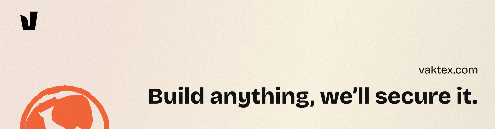
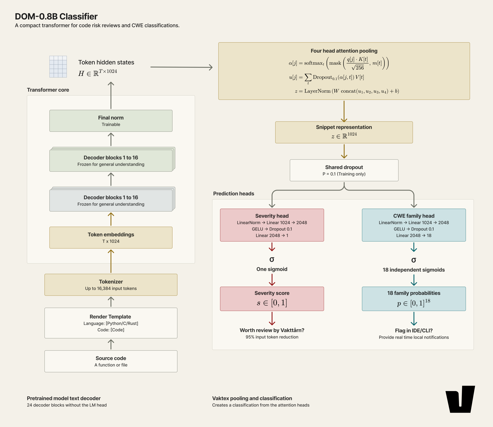
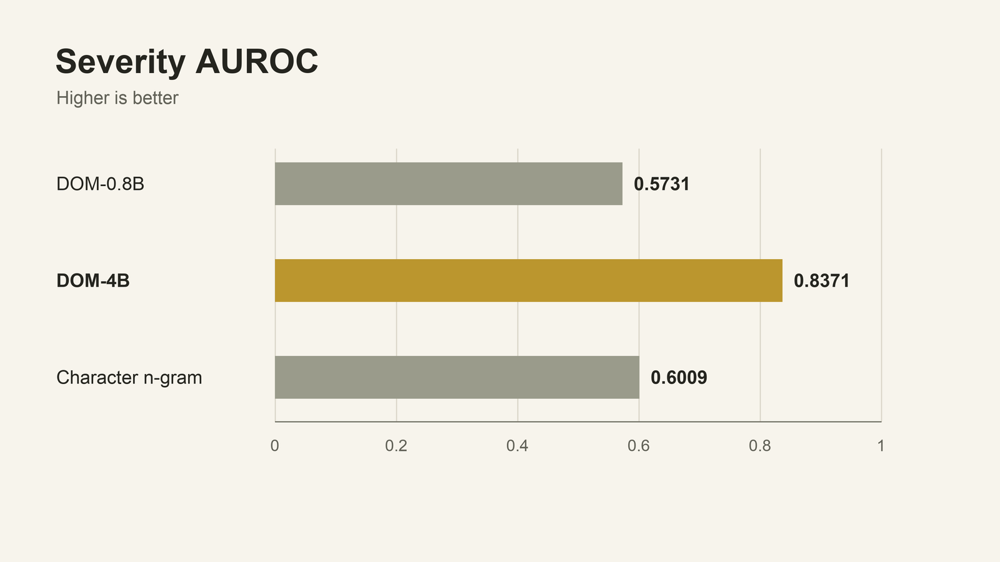

<p align="center">
  <a href="https://vaktex.com/dom-oss">
    
  </a>
</p>

<div align="center">

# vakt

### Speed up code reviews with local risk analysis.

<br/>

<a href="https://github.com/Vaktex/vakt/actions/workflows/build.yml"></a>
<a href="LICENSE"></a>
<a href="https://huggingface.co/vaktex/dom-oss-0.8b"></a>

</div>

> [!TIP]
> `vakt mcp` lets Claude Code, Cursor or any MCP client scan code and read the findings as structured data. See [Use vakt from a coding agent](#use-vakt-from-a-coding-agent).

## Overview

Today we’re introducing DOM-0.8B, an 800M-parameter code-security model, alongside vakt, our local scanner. Our mission is to make security review accessible to everyone, regardless of nationality or budget. It’s free, open weights and fully local. You can now optimize your code review without using cloud models.

Our tool vakt extracts functions from your repository, scores them with DOM-0.8B and ranks them for further investigation. Rather than generating a written review of every function, DOM returns severity and vulnerability-family scores. The aim is to focus human review and generative-model tokens where they are most useful, before the code reaches production.

It runs on Apple Silicon (Metal), NVIDIA GPUs (CUDA 13) and Linux CPUs. Your code never leaves the machine.

**Key capabilities:**

- **Function-level scores:** every function gets its own severity, so you know where to look first
- **18 CWE families:** memory safety, injection, auth, crypto, path handling and more, each with its own calibrated cut-off
- **Free and local:** open weights, no API key and no upload; the model runs on your GPU or CPU
- **Built for CI:** JSON reports, `--fail-on` exit codes, and a score cache so re-scans only score what changed
- **Safe on hostile code:** parsers run in sandboxed workers with memory and time budgets, and a scanned repo can't hide files or escape the scan root

## Use cases

- **Triage a codebase you've just inherited:** get a ranked list of the functions worth a manual review
- **Gate pull requests:** fail CI when a change adds a function that scores above your threshold
- **Give a coding agent a security check:** let it scan and read findings as it writes code
- **Cut the tokens you spend on LLM code review:** send a reviewer model only the functions that scored high, not the whole repo

## Quick start

**Prerequisites:**

- macOS on Apple Silicon, or Linux (amd64/arm64, glibc 2.35+)
- A [Hugging Face](https://huggingface.co) account with access to [vaktex/dom-oss-0.8b](https://huggingface.co/vaktex/dom-oss-0.8b) (it's gated: request access on the model page)

### Install and first scan

```bash
# Install vakt (picks Metal, CUDA 13 or CPU for this machine)
curl -fsSL https://get.vaktex.com/oss-vakt | sh

# Sign in to Hugging Face and download the model (~1.5 GB)
hf auth login
vakt summon

# Scan the current directory
vakt .
```

## Features

### What gets scored

- **Parallel walk:** dependency and build directories (`node_modules`, `vendor`, `.venv`, `target`, `dist`, ...), binary, minified, generated and oversized (> 2 MiB) files are skipped, and every skip is listed in the report
- **Functions, not files:** functions and methods become units with their doc comments, decorators and attributes, which is the shape of code DOM-0.8B was trained on. Top-level code is skipped unless you pass `--top-level`; a file with no functions is scored whole
- **Long functions:** a unit longer than the model's 16,384-token context is split at blank lines and statement boundaries, and shown once with the highest score of its parts
- **Score cache:** scores are cached per model, precision and prompt, so re-scans only score what changed

**Languages with a grammar:** Bash, C, C#, C++, Go, HCL/Terraform, Java, JavaScript, Kotlin, Lua, PHP, Python, Ruby, Rust, Scala, Solidity, TypeScript and VBA. Other languages are scored file by file.

### Hardened against the code it reads

Everything in a scanned repository is treated as untrusted: paths, names and contents.

- **Sandboxed parsing:** each file is parsed in a separate worker process with a memory and time budget; a file that exceeds it is scored whole
- **No escapes:** symlinks never lead outside the scan root, and `--no-repo-ignores` stops a repo's own `.gitignore`/`.vaktignore` from hiding files
- **Clean terminal output:** control characters, ANSI/OSC escapes and bidi overrides are stripped before anything is printed
- **Verified model file:** the safetensors header is validated before the model is loaded, and the weights are pinned to a commit and a sha256

See [docs/SECURITY-DESIGN.md](docs/SECURITY-DESIGN.md) for the details.

### Output

The pretty report ranks flagged functions (severity at or above `--threshold`, default 0.5) with a severity bar, the CWE family and its confidence, location, name and language, then a families histogram and the flagged files.

The family shown is the one that most clears its published cut-off (`thresholds.json` on the model repo), not the raw largest probability: rare families have cut-offs far below 0.5, so the raw maximum would over-report the common ones. The JSON report has every function's severity and all 18 family probabilities.

## Usage examples

### Basic usage

```bash
# Scan the current directory
vakt .

# Stricter threshold, shorter list
vakt patrol src --threshold 0.7 --top 10

# Full detail for finding 1 from the last report
vakt show 1

# Re-render a saved report
vakt report vakt-report.json
```

### Scanning code you don't trust

```bash
# The repo's own ignore files can't hide anything, and only src/ is scanned
vakt patrol ./suspicious-repo --no-repo-ignores --include 'src/**'
```

### Headless mode and exit codes

`vakt` exits 0 when nothing scores at or above the threshold, 1 when something does, 2 on error and 130 when interrupted. With `--fail-on`, it exits 1 only if a function scores at or above that value.

```bash
# Machine-readable output
vakt . --format json --out - | jq .summary

# Fail only on high-confidence findings
vakt . --fail-on 0.9 --quiet
```

### CI/CD (GitHub Actions)

```yaml
name: vakt

on:
  pull_request:

jobs:
  scan:
    runs-on: ubuntu-24.04
    steps:
      - uses: actions/checkout@v6

      - name: Install vakt and the model
        env:
          HF_TOKEN: ${{ secrets.HF_TOKEN }}
        run: |
          curl -fsSL https://get.vaktex.com/oss-vakt | sh -s -- --yes --summon --no-doctor
          echo "$HOME/.local/bin" >> "$GITHUB_PATH"

      - name: Scan
        run: vakt . --fail-on 0.9 --format both
```

> [!TIP]
> Hosted runners have no GPU, so this runs on the CPU. We're working on API access, so CI will be able to score on our GPUs instead of the runner's.

### Options

| Option | Meaning |
|---|---|
| `--precision auto\|fp32\|tf32\|bf16` | `auto` (default) is `tf32` on a GPU and `fp32` on CPU; `fp32` is exact; `tf32` (~1.7x faster on GPUs with matmul units: Apple M5-class, NVIDIA) and `bf16` (~2x) trade a little precision (~1e-3 and ~1e-2) for speed |
| `--include`, `--exclude` | doublestar globs, repeatable |
| `--top-level` | also score code outside functions (imports, globals); these fragments score less reliably |
| `--no-repo-ignores` | ignore the scanned tree's `.gitignore`/`.vaktignore` |
| `--device cpu\|gpu`, `--devices 0,1` | device selection; several GPUs split the work |
| `--no-cache` | don't read or write the score cache |
| `--model path/to/model.safetensors` | use a local checkpoint instead of the Hub |
| `--verbose` | model, backend, device, dtype, tok/s, cache hits and per-finding scores |

`vakt patrol --help` lists every flag.

### Configuration

```bash
export HF_TOKEN="hf_..."            # or run `hf auth login`
export VAKT_CACHE="$HOME/.vakt"     # optional: move all of vakt's caches
```

## Use vakt from a coding agent

`vakt mcp` serves the scanner over the [Model Context Protocol](https://modelcontextprotocol.io) on stdin/stdout, so an agent can scan code and read the findings as structured data instead of parsing the terminal report. Add it to `.cursor/mcp.json`, `claude_desktop_config.json` or your agent's equivalent:

```json
{
  "mcpServers": {
    "vakt": {
      "command": "vakt",
      "args": ["mcp"]
    }
  }
}
```

The agent passes the project directory as `dir` on each call, so one server works across all your repos. To keep it inside one tree, add `--root`, for example `"args": ["mcp", "--root", "~"]` for your home directory or `"args": ["mcp", "--root", "~/work"]` for one projects folder.

| Tool | What it does |
|---|---|
| `scan` | Scan a path and return a summary with the worst findings. This is the expensive call: the model runs over every function |
| `findings` | List what the last scan flagged, filtered by severity, CWE family or file, paged |
| `finding` | One finding in full: score, CWE, and the function's source, so it can be judged without a separate file read |
| `families` | The 18 CWE families and the issue each maps to |

## The model

### Architecture

DOM-0.8B uses a 24-layer text backbone with a hidden width of 1,024. Each of six groups combines three linear-attention layers with one full-attention layer. In the current recipe, the lower 16 layers remain frozen while the upper eight are adapted.

<p align="center">
  
</p>

One backbone pass per input chunk produces token representations. Learned four-head attention pooling in fp32 combines them into a representation for a severity score and 18 CWE family scores.

A generative model processes the input and then decodes its answer one token at a time. DOM processes each input chunk and returns classification scores, without generating a written report. That removes answer-generation work and gives `vakt` fixed outputs it can rank and threshold.

### Benchmarks

Severity AUROC measures how well a model ranks vulnerable code above non-vulnerable code across thresholds. Higher is better; it is not percentage accuracy.

<p align="center">
  
</p>

An AUROC of 0.5 represents chance-level ranking; 1.0 represents perfect separation on the evaluated examples. DOM-4B's score of 0.8371 means a randomly chosen vulnerable example ranks above a randomly chosen non-vulnerable example about 84% of the time, counting ties as half. It does not mean 84% of findings are correct.

DOM-0.8B scores 0.5731, below the character n-gram baseline at 0.6009. That baseline uses recurring text patterns rather than explicit program analysis, making it a useful check on what the model adds. For review workflows, precision and recall at your chosen threshold also matter: they determine how much code gets flagged and how many issues are missed.

### Best practices

- **Route on families:** the family probabilities are the strongest signal. Reading the top one or two is a reasonable triage convention, and a function can legitimately belong to several.
- **Set thresholds on your own code:** the right cut-off depends on how you weigh a missed vulnerability against a false alarm. Choose `--threshold` from a labelled sample of your own repositories, per family where volume allows.
- **Look beyond the function:** the model sees one function at a time, so it can't reason about a flaw whose cause sits in a caller, a configuration file or another service.
- **Prefer functions over large files:** predictions above roughly 8,192 tokens are less well supported, so leave `--top-level` off unless you need it.
- **Expect uneven language coverage:** coverage is strongest in mainstream server-side languages and weaker elsewhere, including smart contracts.

### Pinned weights

`vakt` downloads [`vaktex/dom-oss-0.8b`](https://huggingface.co/vaktex/dom-oss-0.8b) pinned to commit `fe1e7a9` (`brand.ModelCommit`; `model.safetensors` sha256 `a396d4f4601b...`), so a push to the model repo never changes your scores silently. The Go engine matches the PyTorch model on those weights to 2.6e-6 at fp32 and 1.7e-2 at bf16 (`TestParityRelease`, reference in `testdata/parity/release`).

<details>
<summary>Moving to new weights</summary>

1. Download them, regenerate `testdata/parity/release` from the PyTorch
   reference, and check the engine against it:

   ```sh
   vakt summon --model hf:vaktex/dom-oss-0.8b@<new commit>
   VAKT_RELEASE_MODEL=<path printed by summon> go test -tags mlx -run TestParityRelease ./internal/engine
   ```

2. Update `ModelCommit` in `internal/brand/brand.go`, then tag a release.

The PyTorch reference that produces the parity fixtures is part of Vaktex's training code and is not public. The fixtures are committed, so the tests don't need it.

</details>

## Building from source

```bash
make dev BACKEND=fake && go test ./...   # no GPU, no model, no native deps
make deps && make dev                    # the real engine for this machine
```

| Doc | Covers |
|---|---|
| [docs/BUILD.md](docs/BUILD.md) | toolchains, `make dev`/`make prod`, obfuscated release builds, Linux builds in Docker |
| [docs/ARCHITECTURE.md](docs/ARCHITECTURE.md) | how the packages fit together and the rules each one keeps |
| [docs/CI.md](docs/CI.md) | release pipeline, parity fixtures, the self-hosted GPU runner |
| [docs/SECURITY-DESIGN.md](docs/SECURITY-DESIGN.md) | untrusted-input handling and accepted static-analysis findings |

## Contributing

Bug reports and pull requests are welcome. See [CONTRIBUTING.md](CONTRIBUTING.md) to get set up, or open an [issue](https://github.com/Vaktex/vakt/issues). Please report vulnerabilities privately, as described in [SECURITY.md](SECURITY.md).

## Acknowledgements

`vakt` builds on [MLX](https://github.com/ml-explore/mlx), [tree-sitter](https://github.com/tree-sitter/tree-sitter), Hugging Face [tokenizers](https://github.com/huggingface/tokenizers) (through [daulet/tokenizers](https://github.com/daulet/tokenizers)), [bbolt](https://github.com/etcd-io/bbolt), [Cobra](https://github.com/spf13/cobra) and [Lip Gloss](https://github.com/charmbracelet/lipgloss). Thanks to their maintainers.

## License

`vakt` is licensed under the [PolyForm Noncommercial License 1.0.0](LICENSE). You can use, change and share it for any noncommercial purpose: personal projects, research, education, and use by nonprofits and public institutions. Using it to make money, including inside a for-profit company or as part of a paid product or service, needs a commercial license: contact hello@vaktex.com.

> [!WARNING]
> **A score is a lead, not a verdict.** Use the scores to prioritise investigation, then check callers, reachability and assumptions. A high score is not proof of an exploitable vulnerability, and a low one is not proof of safety.
