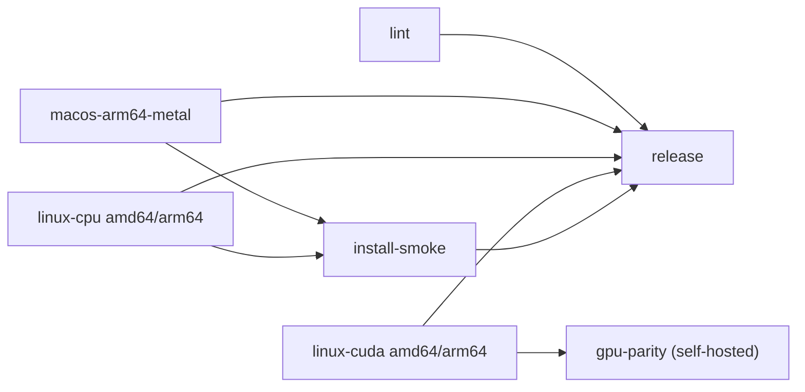

# CI and releases

The workflow is `.github/workflows/build.yml`. It runs on pushes to `main`, pull requests, `v*` tags and manual dispatch.



| Job | Runner | What it does |
|---|---|---|
| `lint` | ubuntu-24.04 | vet, staticcheck, gosec, govulncheck and shellcheck; unit tests on `BACKEND=fake`; bats installer tests under `sh` and `dash` |
| `macos` | macos-15 (arm64) | MLX Metal + tokenizers deps, tests, parity (MLX CPU stream), garble prod build, audit |
| `linux-cuda` | ubuntu-24.04 and ubuntu-24.04-arm | CUDA 13 build inside `nvidia/cuda:13.0.3-cudnn-devel-ubuntu24.04` via `docker run`, plus audit. No GPU, so only fake-engine tests run. |
| `linux-cpu` | ubuntu-24.04 and ubuntu-24.04-arm | MLX CPU (OpenBLAS) build; real engine tests and parity run on the CPU |
| `install-smoke` | macos-15, ubuntu-24.04 | `install.sh --dry-run`, then `install.sh --local` from the built artifacts, then `vakt version` / `vakt doctor` |
| `gpu-parity` | `[self-hosted, linux, gpu]` | CUDA parity and benchmark on a real GPU. Opt-in; see below. |
| `release` | ubuntu-24.04 | Tags only. Collects the artifacts, writes SHA256SUMS, adds build provenance attestations and creates the GitHub Release. |

## Why the CUDA build uses `docker run`

The CUDA devel image plus the MLX CUDA build need more disk than a hosted runner has free. A `container:` job starts before any step can run. Instead, the job first runs `jlumbroso/free-disk-space` on the host, then builds with `docker run` and `.github/scripts/linux-build.sh`. That script also checks the Go toolchain's download against go.dev's published SHA-256.

## Caches

Native libraries (`third_party/mlx/install`, `third_party/tokenizers/lib`) and ccache are cached per OS, arch and backend. The cache key is a hash of `third_party/mlx/VERSIONS` and the two build scripts. **Tag builds never read or write any cache.** Release binaries are always built from source, so a poisoned cache from a PR or branch run can't end up in a release.

## Repository variables

| Variable | Purpose |
|---|---|
| `PARITY_FIXTURES_URL` | HTTPS URL of a `.tar.zst` containing `testdata/models/mock-dom-0.8b/model.safetensors` and `testdata/parity/*`. Build it with `tar --zstd -cf fixtures.tar.zst testdata/models/mock-dom-0.8b testdata/parity`. |
| `PARITY_FIXTURES_SHA256` | Its sha256 (64 lowercase hex characters). The bundle must match it, and may only contain paths under `testdata/models` and `testdata/parity`. |
| `ENABLE_GPU_RUNNER` | Set to `true` once a self-hosted GPU runner is registered. |

Parity steps are skipped with a notice when the fixture variables are unset.

## Self-hosted GPU runner

1. Use a Linux host with an NVIDIA GPU (Turing or newer), driver >= 580, the CUDA 13 toolkit and cuDNN 9, plus Docker, cmake >= 3.27 and a Rust toolchain.
2. Register it under Settings → Actions → Runners with the labels `self-hosted,linux,gpu`.
3. Set `ENABLE_GPU_RUNNER=true`.

The job only runs for pushes and tags on this repository. It never runs for pull requests, so untrusted code never reaches the GPU host.

## Releasing

```sh
git tag v0.1.0 && git push origin v0.1.0
```

The release contains:
- `vakt-darwin-arm64`
- `vakt-linux-{amd64,arm64}-cuda13`
- `vakt-linux-{amd64,arm64}-cpu`
- `install.sh`
- `SHA256SUMS`

Check a download's provenance with `gh attestation verify vakt-darwin-arm64 --repo vaktex/vakt`.

## Security posture

- Every action is pinned to a full commit SHA. Dependabot keeps the pins current.
- Workflow permissions default to `contents: read`. Only `release` gets `contents: write`, `id-token: write` and `attestations: write`.
- `pull_request_target` is never used, and checkouts use `persist-credentials: false`.
- Values that come from the GitHub context reach scripts through `env:`, never by interpolation inside `run:`.
- `actionlint` and `zizmor` are both clean. The three `cache-poisoning` suppressions are covered by the tag-build rule above.
